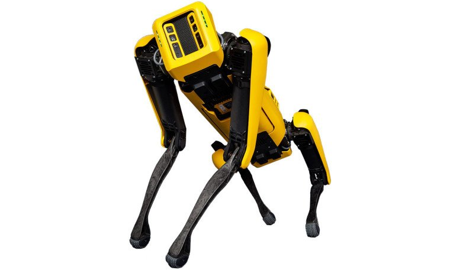
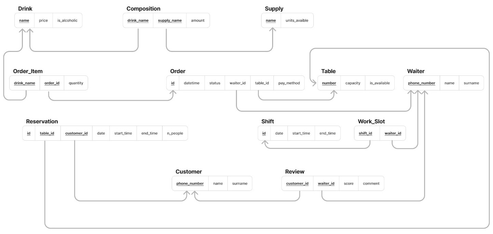
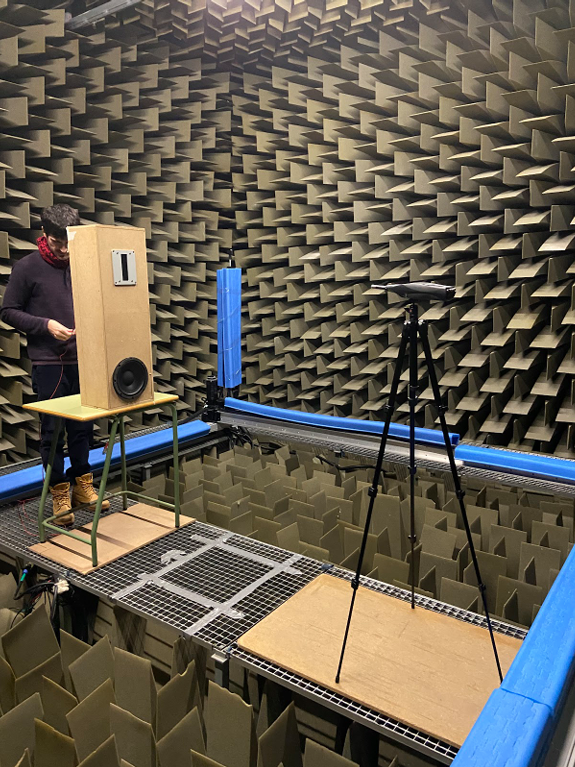
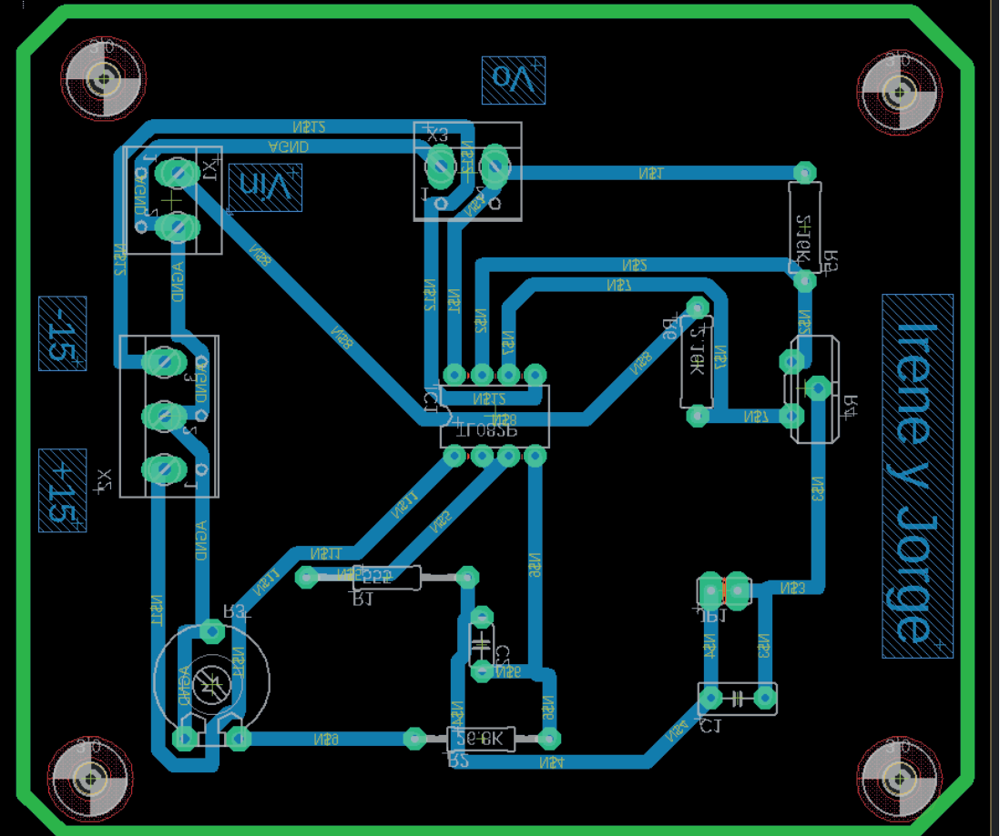
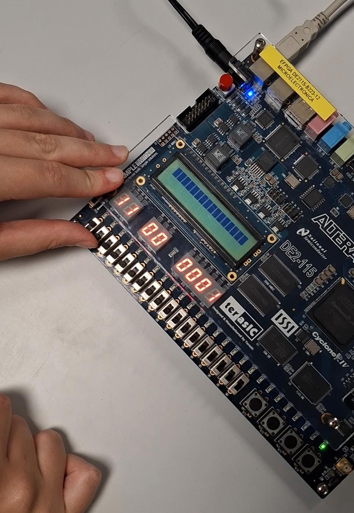

# Hi, I'm Irene Bernad de Olano 👋

Telecommunications Engineer (Dual Degree with Audiovisual Communication, UPV) with hands-on
experience building **AI and Deep Learning for autonomous systems and industrial inspection**,
backed by a solid foundation in mathematics, physics, and signal processing.

From Tenerife, currently based in Valencia. I'm passionate about technology and communication,
and about using both to create positive impact. I combine engineering work with creative and
artistic projects, and I like that it shows.

- 🤖 Experience at **Ford Spain**, building autonomous inspection applications on SPOT (Boston
  Dynamics' quadruped robot) and an internal MLOps platform on GCP.
- 🎓 Dual Degree in Telecommunications Engineering and Audiovisual Communication (UPV,
  2021–2026); Erasmus+ exchange at the Università degli Studi di Padova (2025–2026).
- 🌱 Trained through **Huawei's** "Seeds for the Future" program (5G, AI, and Cloud Computing) and
  the Female Leadership Development Program by EMPLEA UPV / IESE Business School.
- 🦾 **ROS2 Summer School** at FH Aachen (2026): intensive training in teleoperation, image
  processing and LLM-based control across different robots, plus the development of a project
  on a real autonomous-navigation robot (iRobot Create3).
- 💬 Spanish (native), English (C1), Italian and French (basic).

## 🔗 Links

## 🛠️ Tech Stack

**AI / Machine Learning**

**Robotics**

**Software Engineering**

**Telecom & Networking**

## 🚀 Featured Projects

### Software, AI & Data

<table>
<tr>
<td width="60%" valign="top">

**Spx for SPOT / Sentinel EU** — *Ford Spain*

Autonomous inspection platform running on Boston Dynamics' SPOT quadruped robot: real-time
vision pipelines (YOLOv8, OpenCV) on CORE I/O hardware, plus a GCP web platform for training,
packaging, and compliance approval of AI models.

`Python` `YOLOv8` `OpenCV` `gRPC` `Docker` `GCP`

No source code — Ford-owned project

</td>
<td width="40%" valign="top">

</td>
</tr>
</table>
<!-- TODO: link to github.com/irene-bernad-de-olano/<repo> once it exists -->

<table>
<tr>
<td width="60%" valign="top">

**ROS2 Autonomous Room Explorer** — *ROS2 Summer School, FH Aachen*

ROS2 system for an iRobot Create3 that maps an arena with SLAM, localizes itself with AMCL and
navigates to goals with Nav2. It can be driven by gamepad, by spoken movement commands
(Whisper + an LLM) and by hand gestures recognized with a custom-trained YOLOv8 model. Built in a
team of two and run on the real robot.

`ROS2` `Nav2` `SLAM Toolbox` `YOLOv8` `Whisper` `Python`

[View repository](https://github.com/irene-bernad-de-olano/ROS2-Autonomous-Room-Explorer)

</td>
<td width="40%" valign="top">

</td>
</tr>
</table>

<table>
<tr>
<td width="60%" valign="top">

**Traffic Lane & Vehicle Detection**

Computer vision system that detects the road lane from a dashboard camera and classifies nearby
vehicles as left / right / ego lane; simulates core functions of an ADAS system, with a
per-camera calibration trick to keep it fast on video.

`Python` `OpenCV` `NumPy` `YOLO`

[View repository](https://github.com/irene-bernad-de-olano/Traffic-support-Computer-Vision)

</td>
<td width="40%" valign="top">
</img>
</td>
</tr>
</table>

<table>
<tr>
<td width="60%" valign="top">

**SpritzQL — Bar Management Database System**

Relational database for a bar carried through the full lifecycle: requirements, ER model,
logical schema, DuckDB SQL implementation, and a Java/JDBC client that queries it end to end.

`SQL` `DuckDB` `Java` `JDBC` `Maven`

[View repository](https://github.com/irene-bernad-de-olano/Bar-Management-Database)

</td>
<td width="40%" valign="top">

</td>
</tr>
</table>

### Electronics

<table>
<tr>
<td width="60%" valign="top">

**Empire Sound — Loudspeaker System**

Two-way loudspeaker (woofer + tweeter) designed, built, measured and tuned from scratch inside a
custom enclosure; anechoic-chamber characterization with a measured sensitivity of 101.5 dB.

`ARTA` `LIMP` `STEPS` `Acoustics`

[View repository](https://github.com/irene-bernad-de-olano/Empire-sound-Loudsystem)

</td>
<td width="40%" valign="top">

</td>
</tr>
</table>

<table>
<tr>
<td width="60%" valign="top">

**PCB Equalizer Filter**

Analog peak/shelving audio filter with configurable gain and center frequency: theoretical
design, PSpice simulation, EAGLE PCB layout, fabrication and lab validation against theory.

`Analog Electronics` `PSpice` `EAGLE`

[View repository](https://github.com/irene-bernad-de-olano/PCB-equalizer-filter)

</td>
<td width="40%" valign="top">

</td>
</tr>
</table>

<table>
<tr>
<td width="60%" valign="top">

**Bidirectional Serial Link — PIC16F877 Warehouse Alarm Panel**

Bare-metal C for a PIC16F877: interrupt-driven full-duplex UART (2400 baud) between the
microcontroller and a PC. The MCU reports which of 8 warehouse doors is open; the PC streams
the time back as framed 4-byte packets, shown on a Timer0-multiplexed 4-digit display.
Verified in Proteus.

`C` `PIC` `UART / RS-232` `Proteus` `MPLAB`

Repo coming soon

</td>
<td width="40%" valign="top">

</td>
</tr>
</table>

<!-- TODO: link to github.com/irene-bernad-de-olano/<repo> once it exists (FPGA/ folder — misnamed, it's a PIC microcontroller project) -->

### Creative

**Tech4Inclusion**
Digital training and employability platform for unaccompanied migrant minors, developed during
the Female Leadership Development Program (EMPLEA UPV / IESE Business School), in collaboration
with Huawei. Award-nominated.
[View on portfolio](https://irenebernaddeolano.wixsite.com/irenebernadportfolio)
<!-- TODO: link to github.com/irene-bernad-de-olano/<repo> once it exists -->

**Una Noche para Recordar**
Short film about nighttime violence, selected at the "Human Fest" International Film and Human
Rights Festival. Role: director and director of photography.
[View on portfolio](https://irenebernaddeolano.wixsite.com/irenebernadportfolio)
<!-- TODO: link to github.com/irene-bernad-de-olano/<repo> once it exists -->

## 🎓 Education & Experience

**Education:** Dual Degree in Telecommunications Engineering and Audiovisual Communication, UPV
(2021–2026); Erasmus+ exchange at the Università degli Studi di Padova, master's-level courses
in ICT for Internet and Multimedia (2025–2026).

**Experience:** AI, Software & Robotics Engineering Intern at Ford Spain (Industrial Systems,
Valencia, 2026), building autonomous inspection applications on SPOT. Previously, interactive
lighting systems technician (Gandía, 2024).

More detail in my [CV](https://irenebernaddeolano.wixsite.com/irenebernadportfolio) or on
[LinkedIn](https://www.linkedin.com/in/irene-bernad-de-olano-b33683270).
